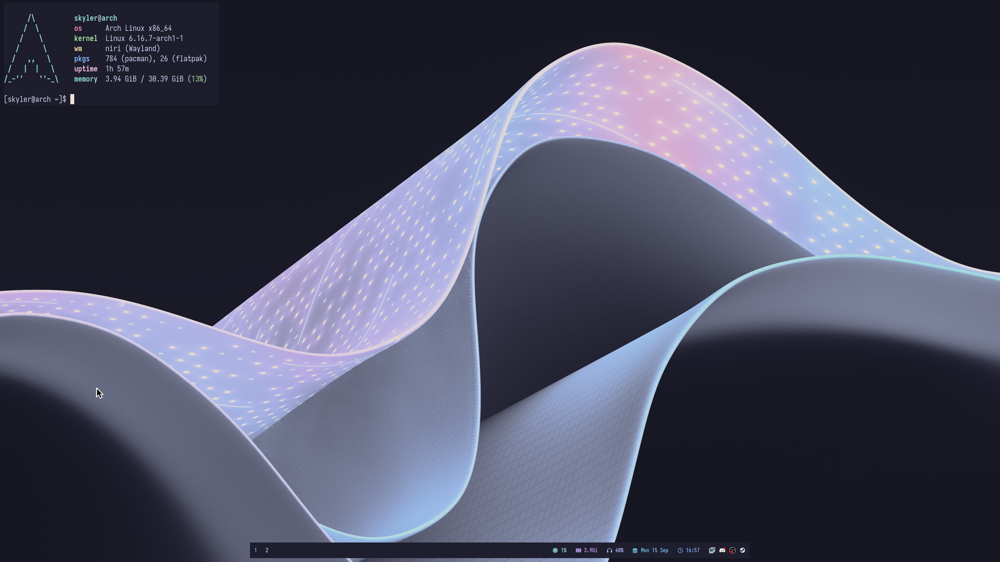

# my dots
<p align="center">

</p>

# install
```bash
# niri example
git clone https://github.com/skylerfrags/dotfiles.git
ln -s ~/dotfiles/niri/ ~/.config
```

## what i use

|   Component                 | Software                                                                                      |
| --------------------------- | :---------------------------------------------------------------------------------------------:
| **Distro(s)**               | Arch (main) Void/Gentoo (testing) |
| **Window Manager**          | Niri |
| **Bar**                     | Waybar |
| **Application Launcher**    | Fuzzel |
| **Wallpaper Daemon**        | swww |
| **Wallpaper Picker**        | Waypaper |
| **Terminal Emulator**       | Alacritty |
| **File Manager**            | Nautilus |
| **Font**                    | Iosevka |
| **Media Player**            | mpv |
